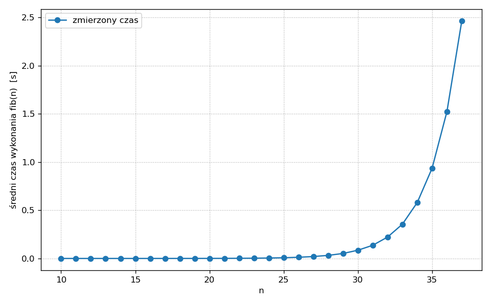
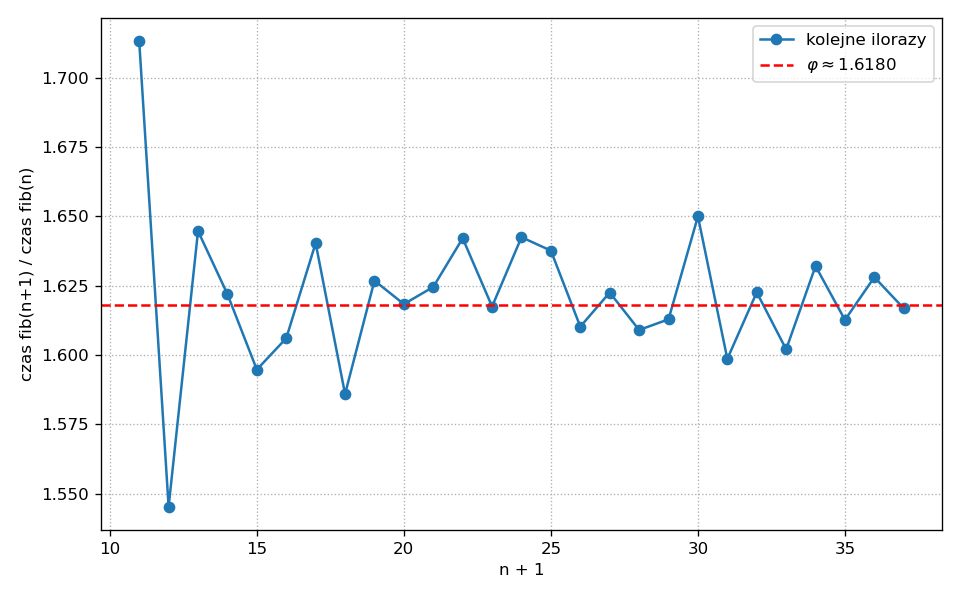
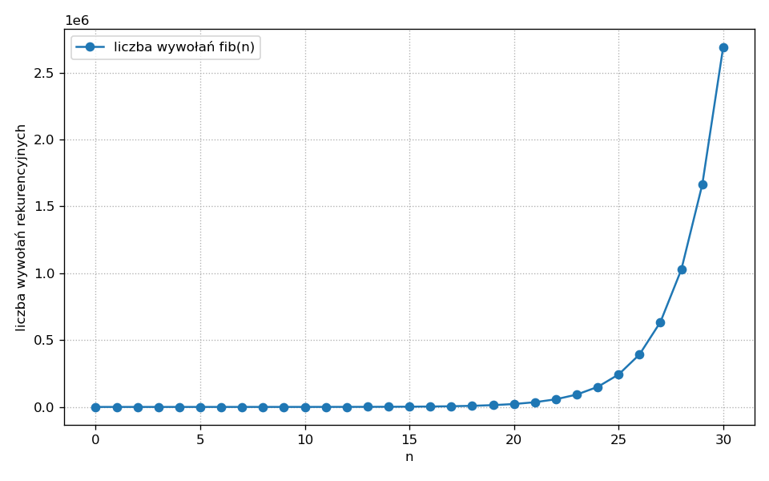
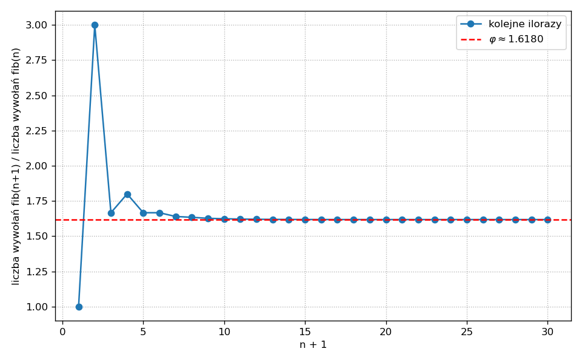

## Literatura

Na temat rekurencji (i nie tylko) bardzo polecam wykłady CS1 z Berkeley: [*Composing Programs*](https://www.composingprograms.com/pages/17-recursive-functions.html). Rekurencja omawiana jest tam m.in. [tutaj](http://www.composingprograms.com/pages/17-recursive-functions.html) i [tutaj](http://www.composingprograms.com/pages/28-efficiency.html).

Warto też zajrzeć do legendarnego podręcznika [SICP](https://web.mit.edu/6.001/6.037/sicp.pdf). Programy prezentowane są tam w języku Scheme.

## Rekurencja

Funkcję nazywamy **rekurencyjną**, gdy wywołuje samą siebie. Wywołanie to może być bezpośrednie lub pośrednie. Implementacja rekurencji polega często na obserwacji, że rozwiązanie problemu dla pewnych szczególnych argumentów jest oczywiste, a dla argumentów ogólnych prosto wyraża się przez rozwiązanie **tego samego** problemu dla argumentów "prostszych", znajdujących się w jakimś sensie "bliżej" przypadku oczywistego.

### Przykład: suma kolejnych liczb naturalnych

Chcemy napisać funkcję `suma_naturalnych(n)` zwracającą sumę kolejnych liczb naturalnych od `1` do `n`:

$$
1 + 2 + \ldots + n.
$$

Przypadek szczególny to `n == 0`. Wtedy mamy sumę po zbiorze pustym, czyli `0`. Nic nie trzeba liczyć, wynik jest oczywisty. Dla `n` przekraczających `0` mamy przypadek ogólny, o którym myślimy tak: gdyby suma dla argumentu `n - 1` była już obliczona, to wynikiem byłaby wartość tej sumy powiększona o `n`. Inaczej mówiąc:

* `suma_naturalnych(0)` zwraca `0`,
* `suma_naturalnych(n)` zwraca `n + suma_naturalnych(n - 1)` dla `n > 0`.

Implementacja rekurencyjna:

```python
>>> def suma_naturalnych(n):
...     '''Zwraca 1 + 2 + ... + n'''
...     if n == 0:
...         return 0
...     return n + suma_naturalnych(n - 1)
>>> suma_naturalnych(5)
15
```

Prześledźmy przebieg wywołania `suma_naturalnych(5)`:

```
suma_naturalnych(5)
5 + suma_naturalnych(4)
5 + (4 + suma_naturalnych(3))
5 + (4 + (3 + suma_naturalnych(2)))
5 + (4 + (3 + (2 + suma_naturalnych(1))))
5 + (4 + (3 + (2 + (1 + suma_naturalnych(0)))))
5 + (4 + (3 + (2 + (1 + 0))))
5 + (4 + (3 + (2 + 1)))
5 + (4 + (3 + 3))
5 + (4 + 6)
5 + 10
15
```

Zauważ, że ten "wybrzuszający się" łańcuch operacji musi być zapamiętywany. Powiemy, że funkcja `suma_naturalnych()` jest rekurencyjna oraz że jej wywołanie generuje **proces rekurencyjny**: buduje łańcuch odłożonych operacji, które muszą być zapamiętane. Im dłuższy proces, tym więcej operacji zostaje odłożonych.

### Limit głębokości rekurencji

W Pythonie istnieje limit na liczbę odłożonych wywołań. Przekroczenie go skutkuje wyjątkiem `RecursionError`:

```python
>>> import sys
>>> sys.getrecursionlimit()
1000
>>> suma_naturalnych(1000)
Traceback (most recent call last):
  ...
RecursionError: maximum recursion depth exceeded
>>> sys.setrecursionlimit(4000)
>>> suma_naturalnych(3000)
4501500
```

Nasza funkcja `suma_naturalnych()` nie ma zatem zbyt wielu zalet w porównaniu z implementacją za pomocą pętli: zajmuje pamięć (tym więcej, im większe `n`), a przy tym nie jest w stanie zwrócić wyniku dla niedużego przecież `n` równego `1000`.

### Rekurencja a pętla

Sumowanie zakodowane przy pomocy pętli `while`:

```python
>>> def suma_naturalnych(n):
...     '''Zwraca 1 + 2 + ... + n'''
...     k, suma = 0, 0
...     while k < n:
...         k += 1
...         suma += k
...     return suma
>>> suma_naturalnych(5)
15
```

W pętli obsługujemy dwie zmienne: kroczącą sumę `suma` i dodawaną wartość `k`. Tak samo będzie z pętlą `for`, z tym że wtedy pętla sama zajmie się aktualizacją `k`:

```python
>>> def suma_naturalnych(n):
...     '''Zwraca 1 + 2 + ... + n'''
...     suma = 0
...     for k in range(1, n + 1):
...         suma += k
...     return suma
>>> suma_naturalnych(5)
15
```

Okazuje się, że rekurencja potrafi odwzorować zwykłą pętlę. Zmienne (być może liczne) przetwarzane w pętli przekazuje się kolejnym wywołaniom rekurencyjnym za pomocą argumentów:

```python
>>> def sumuj(n, suma):
...     '''Zwraca suma + (1 + 2 + ... + n)'''
...     if n == 0:
...         return suma
...     return sumuj(n - 1, n + suma)
>>> def suma_naturalnych(n):
...     '''Zwraca 1 + 2 + ... + n'''
...     return sumuj(n, 0)
>>> suma_naturalnych(5)
15
```

Rekurencyjna jest funkcja `sumuj()`. Rozpiszmy przykładowy łańcuch wywołań:

```
suma_naturalnych(5)
sumuj(5, 0)
sumuj(4, 5)
sumuj(3, 9)
sumuj(2, 12)
sumuj(1, 14)
sumuj(0, 15)
15
```

Tym razem nie ma łańcucha odłożonych operacji, proces się nie "wybrzusza". Funkcja `sumuj()` jest rekurencyjna, ale implementuje **proces iteracyjny**: operacje dodawania wykonywane są od razu i zapamiętywane w dodatkowej zmiennej `suma`. Z tego punktu widzenia rekurencyjność `sumuj()` jest jedynie własnością **składniową**, samo wywołanie jest równoważne zwykłej pętli.

### Rekurencja ogonowa

::: {.callout-important}
## Rekurencja ogonowa
Mówimy, że wywołanie rekurencyjne jest **w pozycji ogonowej**, jeśli jest ostatnią operacją wykonywaną w danej ścieżce funkcji — wartość tego wywołania jest bezpośrednio zwracana, bez żadnych dalszych operacji czekających na jej wynik. Funkcję, w której wszystkie wywołania rekurencyjne są w pozycji ogonowej, nazywamy **rekurencją ogonową**.
:::

W `sumuj()` ostatnia operacja w gałęzi rekurencyjnej to `return sumuj(n - 1, n + suma)` — wartość wywołania rekurencyjnego jest wprost zwracana. Dlatego `sumuj()` jest rekurencją ogonową.

Tymczasem w `suma_naturalnych(n)` w gałęzi rekurencyjnej mamy `return n + suma_naturalnych(n - 1)` — na wynik wywołania rekurencyjnego czeka jeszcze dodawanie `n + …`. Wywołanie nie jest zatem w pozycji ogonowej i funkcja nie jest rekurencją ogonową.

### Optymalizacja wywołań ogonowych

Jeżeli środowisko uruchomieniowe "wie", że wywołanie rekurencyjne jest w pozycji ogonowej, to może nie odkładać na stosie nowej ramki — po prostu podmienia zawartość bieżącej. Wywołanie `sumuj(4, 5)` nie musi być pamiętane, kiedy już działa `sumuj(3, 9)`; po zakończeniu `sumuj(3, 9)` uruchamiane jest `sumuj(2, 12)`, zatem ramkę po `sumuj(3, 9)` można bez szkody porzucić, itd.

Mówimy, że język programowania posiada **optymalizację wywołań ogonowych** (*tail call optimization*, TCO), jeśli potrafi wykonywać rekurencję ogonową bez wzrostu głębokości stosu. Python **nie posiada** takiej zdolności — i jest to świadoma decyzja projektowa Guido van Rossuma, który argumentował, że utrudniłaby ona czytelność stack trace'ów i diagnostykę błędów (zob. [*Tail Recursion Elimination*](https://neopythonic.blogspot.com/2009/04/tail-recursion-elimination.html) na blogu Guido).

Mimo, że tworzenie łańcucha odłożonych operacji nie jest konieczne dla wywołania `sumuj()`, to i tak dla dużych `n` wywołanie to kończy się wyjątkiem `RecursionError`:

```python
>>> sumuj(3000, 0)
Traceback (most recent call last):
  ...
RecursionError: maximum recursion depth exceeded
```

### Jeszcze jeden przykład

Prosta pętla odliczająca:

```python
>>> def odlicz(k):
...     '''Odlicza od k do 0'''
...     while k > 0:
...         print('Odliczanie:', k)
...         k -= 1
...     print('Start!:    ', 0)
>>> odlicz(5)
Odliczanie: 5
Odliczanie: 4
Odliczanie: 3
Odliczanie: 2
Odliczanie: 1
Start!:     0
```

i zastępująca ją rekurencja ogonowa:

```python
>>> def odlicz(k):
...     '''Odlicza od k do 0'''
...     if k > 0:
...         print('Odliczanie:', k)
...         return odlicz(k - 1)
...     print('Start!:    ', k)
>>> odlicz(5)
Odliczanie: 5
Odliczanie: 4
Odliczanie: 3
Odliczanie: 2
Odliczanie: 1
Start!:     0
```

### Kiedy używać rekurencji?

Sprawne korzystanie z rekurencji wymaga praktyki. W wielu językach brak TCO powoduje, że rozwiązanie rekurencyjne jest mniej wydajne niż równoważna pętla; ponadto, niektóre języki bardziej wspierają idiom rekurencji, inne mniej. Korzystanie z pętli w Pythonie, zwłaszcza z pętli `for` po kolekcjach, jest bardzo naturalne i nie ma wielkiego sensu zastępowanie takiej pętli wymyślną rekurencją ogonową, która i tak nie zostanie zoptymalizowana. Z drugiej strony, w językach takich jak Lisp, jego dialekt [Scheme](https://www.gnu.org/software/mit-scheme/documentation/mit-scheme-ref/Iteration.html) czy [Haskell](http://learnyouahaskell.com/recursion) nie ma w ogóle instrukcji sterujących odpowiadających zwykłym pętlom — zachowanie pętli implementowane jest rekurencją (ze wspieraną TCO) lub wykonywane niejawnie przez wywołania funkcyjne. W tych językach stosowanie rekurencji jest bardzo naturalne.

Rekurencja jest ogólniejsza od pętli, jednak rozwiązania wykorzystujące pętle uchodzą za łatwiejsze do zrozumienia. Zasada ta ma wiele wyjątków — zdarza się, że rozwiązanie rekurencyjne jest znacznie prostsze do znalezienia niż jakiekolwiek rozwiązanie iteracyjne. Przykładu dostarcza problem liczby podziałów liczby naturalnej, o którym możesz poczytać [tutaj](http://composingprograms.com/pages/17-recursive-functions.html#example-partitions) w *Composing Programs*.

Bardzo ważna metodyka projektowania algorytmów, [dziel i zwyciężaj](https://pl.wikipedia.org/wiki/Dziel_i_zwyci%C4%99%C5%BCaj), dostarcza wielu przykładów problemów z wydajnymi rozwiązaniami rekurencyjnymi. Czołowe przykłady to [wyszukiwanie binarne](https://pl.wikipedia.org/wiki/Wyszukiwanie_binarne), [sortowanie szybkie](https://pl.wikipedia.org/wiki/Sortowanie_szybkie) i [sortowanie przez scalanie](https://pl.wikipedia.org/wiki/Sortowanie_przez_scalanie).

***

## Rekurencja w ciągu Fibonacciego

### Definicja i naiwna implementacja

Ciąg Fibonacciego matematycy definiują następująco:

$$
F_0 := 0,\quad F_1 := 1,
$$

i dla $n \geqslant 2$:

$$
F_n := F_{n-2} + F_{n-1}.
$$

Definicja ta przekłada się wprost na funkcję obliczającą `n`-ty wyraz:

```python
>>> def fib(n):
...     '''Zwraca F_n, n >= 0, ciągu Fibonacciego.'''
...     if n < 2:
...         return n
...     return fib(n - 1) + fib(n - 2)
>>> fib(10)
55
```

Łańcuch kolejnych wywołań i odłożonych operacji dla `fib(5)` ma postać:

```
fib(5)
fib(4) + fib(3)
(fib(3) + fib(2)) + fib(3)
((fib(2) + fib(1)) + fib(2)) + fib(3)
(((fib(1) + fib(0)) + fib(1)) + fib(2)) + fib(3)
(((1 + 0) + fib(1)) + fib(2)) + fib(3)
((1 + fib(1)) + fib(2)) + fib(3)
((1 + 1) + fib(2)) + fib(3)
(2 + fib(2)) + fib(3)
(2 + (fib(1) + fib(0))) + fib(3)
(2 + (1 + 0)) + fib(3)
(2 + 1) + fib(3)
3 + fib(3)
3 + (fib(2) + fib(1))
3 + ((fib(1) + fib(0)) + fib(1))
3 + ((1 + 0) + fib(1))
3 + (1 + fib(1))
3 + (1 + 1)
3 + 2
5
```

[Tutaj](http://composingprograms.com/pages/28-efficiency.html) znajduje się przedstawienie ciągu wywołań dla `fib(6)` w postaci drzewa binarnego:


Co widzimy? Ta rekurencja nie jest ogonowa — generowany proces jest faktycznie rekurencyjny, i co więcej nie jest liniowy, lecz drzewiasty. Spodziewamy się, że już dla niewielkich `n` wywołania będą mało wydajne ze względu na liczbę powtórzeń pojawiających się w drzewie: dla `fib(6)` wartość `fib(4)` jest obliczana dwa razy, `fib(3)` trzy razy, itd.

### Analiza czasu wykonania

Zbadajmy eksperymentalnie, jak czas wykonania `fib(n)` zależy od `n`. Do szybkich pomiarów użyjemy funkcji `timeit()` z modułu o tej samej nazwie:

```python
>>> from timeit import timeit
>>> timeit(lambda: fib(10), number=1_000_000) / 1_000_000
6.117e-06
>>> timeit(lambda: fib(20), number=1_000) / 1_000
0.00078
>>> timeit(lambda: fib(30), number=10) / 10
0.093
>>> timeit(lambda: fib(37), number=1) / 1
2.70
>>> timeit(lambda: fib(41), number=1) / 1
19.08
```

(Konkretne wartości oczywiście zależą od komputera.)

Dla `fib(37)` czas jest już rzędu kilku sekund, a dla `fib(41)` przekracza kwadrans. Dalej tym sposobem daleko nie zajedziemy.

Systematyczny pomiar zbiera skrypt `src/fib_naive.py` — mierzy średni czas wykonania `fib(n)` dla $n = 10, 11, \ldots, 37$ i drukuje tabelę wyników:

```python
# Path: src/fib_naive.py
"""
Naiwna, bezpośrednio rekurencyjna implementacja ciągu Fibonacciego
oraz pomiar średniego czasu wykonania fib(n) dla rosnących n.

Sposób użycia:
python fib_naive.py
"""
from timeit import timeit


def fib(n):
    """Zwraca F_n, n >= 0, ciągu Fibonacciego."""
    if n < 2:
        return n
    return fib(n - 1) + fib(n - 2)


def zmierz_czasy(n_start=10, n_stop=37):
    """Zwraca listę par (n, średni czas wykonania fib(n))."""
    wyniki = []
    for n in range(n_start, n_stop + 1):
        # Liczba powtórzeń maleje wraz ze wzrostem n, bo pojedyncze
        # wywołanie robi się coraz wolniejsze.
        if n < 25:
            powtórzeń = 1_000
        elif n < 33:
            powtórzeń = 10
        else:
            powtórzeń = 1
        czas = timeit(lambda: fib(n), number=powtórzeń) / powtórzeń
        wyniki.append((n, czas))
    return wyniki


def main():
    print(f"{'n':>3} | {'F_n':>12} | {'średni czas [s]':>18}")
    print("-" * 42)
    for n, czas in zmierz_czasy():
        print(f"{n:>3} | {fib(n):>12} | {czas:>18.6f}")


if __name__ == "__main__":
    main()
```

Wykres zebranych czasów:



A teraz spójrzmy na stosunek kolejnych czasów wykonania, $T(n+1)/T(n)$:



::: {.callout-important}
## Obserwacja
Stosunki kolejnych czasów są w przybliżeniu stałe i dążą do wartości
$$
\varphi = \tfrac{1 + \sqrt{5}}{2} \approx 1{,}618\ldots
$$
czyli **złotej liczby**.
:::

Jeżeli kolejne ilorazy czasów są stałe, to sam ciąg czasów wykonania powinien być dobrze przybliżany przez ciąg geometryczny:

$$
T(n) \approx a \cdot \varphi^n
$$

dla pewnej stałej $a$. Wartość $a$ można wyznaczyć metodą regresji liniowej, logarytmując obustronnie powyższe równanie. Tych szczegółów nie będziemy tu przepisywać — kod dopasowujący znajdziesz w skrypcie [`src/fib_analiza.py`](src/fib_analiza.py) na GitHubie.

Zauważ, że związek czasu wykonania ze złotą liczbą nie jest przypadkiem (SICP, §1.2.2): $F_n$ rośnie jak $\varphi^n$, a my — jak się za chwilę przekonamy — wywołujemy `fib()` mniej więcej tyle razy, ile wynosi wartość samego $F_n$.

Akceptując powyższe dopasowanie, możemy oszacować, ile czasu zajęłoby wykonanie `fib(100)`. Ponieważ $\varphi^{100} \approx 7{,}9 \cdot 10^{20}$, to nawet przy wyjściowym $T(10)$ rzędu pojedynczych mikrosekund dostajemy

$$
T(100) \sim 10^{14} \text{ s} \approx 10^{7} \text{ lat}.
$$

::: {.callout-note}
## Czas oczekiwania rzędu dziesiątek milionów lat
Zwróć uwagę, że mówimy tu o **czasie**. Wywołanie `fib(n)` jest bardzo czasochłonne, nie wymaga jednak dużej pamięci: lista odłożonych w danej chwili operacji jest taka jak głębokość drzewa, czyli proporcjonalna do `n`.
:::

### Liczba wywołań rekurencyjnych

Dokładniejsze wyniki uzyskamy, licząc wywołania rekurencyjne funkcji `fib()`. Z drzewa wyrysowanego wyżej odczytać można, że dla `fib(6)` mamy dokładnie 25 wywołań: 12 wywołań wewnątrz drzewa plus 13 liści (każdy liść to wywołanie `fib(0)` lub `fib(1)`, które zwraca natychmiast).

A ile wywołań zrobi `fib(35)`? A `fib(100)`?

#### Atrybuty funkcji

Wielkość tę można obliczyć teoretycznie. My postąpimy praktycznie: zmusimy funkcję, aby sama pamiętała i aktualizowała liczbę swoich wywołań. Liczbę tę wygodnie będzie przechowywać jako atrybut funkcji.

W Pythonie funkcji (tak jak i większości obiektów) można dopisywać atrybuty. Po zdefiniowaniu funkcji o nazwie `f` możemy jej przypisać atrybut zgodnie ze składnią:

```python
>>> def fun():
...     pass
>>> fun.napis = 'Jestem atrybutem!'
>>> fun.liczba = 9 ** 9
>>> fun.napis
'Jestem atrybutem!'
>>> fun.liczba
387420489
```

Atrybuty zdefiniowane przez użytkownika są przechowywane w atrybucie `__dict__` w postaci słownika:

```python
>>> fun.__dict__
{'napis': 'Jestem atrybutem!', 'liczba': 387420489}
```

#### Dekorator zliczający wywołania

Napiszmy dekorator, który doda atrybut `liczba_wywołań` do zmodyfikowanej funkcji. Atrybut ten ustawiamy na zero, a przy każdym wywołaniu funkcji podnosimy o jeden:

```python
>>> from functools import wraps
>>> def licz_wywołania(f):
...     '''Przechowuje liczbę wywołań f() w atrybucie licznik.liczba_wywołań.'''
...     @wraps(f)
...     def licznik(*args, **kwargs):
...         licznik.liczba_wywołań += 1
...         return f(*args, **kwargs)
...     licznik.liczba_wywołań = 0
...     return licznik
```

Przetestujmy go na funkcji `suma_naturalnych()`:

```python
>>> @licz_wywołania
... def suma_naturalnych(n):
...     '''Zwraca 1 + 2 + ... + n'''
...     if n == 0:
...         return 0
...     return n + suma_naturalnych(n - 1)
>>> suma_naturalnych.liczba_wywołań
0
>>> suma_naturalnych(5)
15
>>> suma_naturalnych.liczba_wywołań
6
```

Sześć wywołań (`n = 5, 4, 3, 2, 1, 0`) — zgadza się.

#### Liczba wywołań naiwnego fib

Zastosujmy `licz_wywołania` do `fib()`. Kompletny skrypt:

```python
# Path: src/fib_licznik.py
"""
Dekorator zliczający wywołania funkcji, zastosowany do naiwnej rekurencji
Fibonacciego.

Sposób użycia:
python fib_licznik.py
"""
from functools import wraps


def licz_wywołania(f):
    """Przechowuje liczbę wywołań f() w atrybucie licznik.liczba_wywołań."""
    @wraps(f)
    def licznik(*args, **kwargs):
        licznik.liczba_wywołań += 1
        return f(*args, **kwargs)
    licznik.liczba_wywołań = 0
    return licznik


@licz_wywołania
def fib(n):
    """Zwraca F_n, n >= 0, ciągu Fibonacciego."""
    if n < 2:
        return n
    return fib(n - 1) + fib(n - 2)


def main():
    print(f"{'n':>3} | {'F_n':>12} | {'liczba wywołań':>16}")
    print("-" * 40)
    for n in range(0, 31):
        # Reset licznika przed każdym pomiarem.
        fib.liczba_wywołań = 0
        wartość = fib(n)
        print(f"{n:>3} | {wartość:>12} | {fib.liczba_wywołań:>16}")


if __name__ == "__main__":
    main()
```

Wyniki są dokładne, więc małych wartości nie musimy pomijać. Wykres liczby wywołań:



Stosunek kolejnych liczb wywołań:



Znów widzimy zbieżność do $\varphi$! Nie jest to przypadek — można wykazać, że liczba wywołań $T(n)$ funkcji `fib()` spełnia rekurencję
$$
T(0) = T(1) = 1,\qquad T(n) = T(n-1) + T(n-2) + 1,
$$
skąd $T(n) = 2 F_{n+1} - 1$. Zatem — podobnie jak ciąg Fibonacciego — liczba wywołań rośnie jak $\varphi^n$.

Dla `fib(30)` liczba wywołań wynosi $T(30) = 2 F_{31} - 1 = 2\,692\,537$. Dla `fib(100)` dostajemy:

$$
T(100) = 2 F_{101} - 1 \approx 7{,}3 \cdot 10^{20}.
$$

Ponad siedemset trylionów wywołań — i to właśnie dlatego naiwny `fib(100)` byłby niewykonalny za naszego życia.

***

## Ratowanie definicji rekurencyjnej — memoizacja

Skąd bierze się ta katastrofa wydajności? W bezpośredniej implementacji definicji rekurencyjnej funkcja `fib()` jest wywoływana wielokrotnie na tych samych argumentach: `fib(30)` oblicza `fib(28)` dwa razy, `fib(27)` trzy razy, `fib(0)` — aż $F_{30} = 832\,040$ razy.

Kłopot ten rozwiążemy, **zapamiętując** wyniki pośrednie. Ta technika nazywa się **memoizacją**.

### Słownik pamięci w domknięciu

Najprostsza idea: wewnątrz `fib()` trzymamy słownik `pamięć` mapujący argumenty na obliczone wcześniej wartości. Zanim zaczniemy liczyć, sprawdzamy, czy wynik już jest w pamięci. Słownik umieścimy jako zmienną swobodną w domknięciu — nie chcemy, żeby zaśmiecał globalną przestrzeń nazw:

```python
>>> def stwórz_fib_z_pamięcią():
...     pamięć = {}
...     def fib(n):
...         if n < 2:
...             return n
...         if n not in pamięć:
...             pamięć[n] = fib(n - 1) + fib(n - 2)
...         return pamięć[n]
...     return fib
>>> fib_z_pamięcią = stwórz_fib_z_pamięcią()
>>> fib_z_pamięcią(100)
354224848179261915075
```

Wynik dla `fib(100)` otrzymujemy w ułamku sekundy zamiast w dziesiątkach milionów lat. 

### Dekorator zapamiętujący

Konstrukcję z pamięcią w domknięciu można wygodnie przełożyć na dekorator stosowalny do dowolnej funkcji jednej zmiennej:

```python
>>> def zapamiętuj(f):
...     pamięć = {}
...     @wraps(f)
...     def wrapper(x):
...         if x not in pamięć:
...             pamięć[x] = f(x)
...         return pamięć[x]
...     return wrapper
```

Dzięki dekoratorowi zachowujemy czytelność definicji rekurencyjnej:

```python
>>> @zapamiętuj
... def fib(n):
...     '''Zwraca F_n, n >= 0, ciągu Fibonacciego.'''
...     if n < 2:
...         return n
...     return fib(n - 1) + fib(n - 2)
>>> fib(100)
354224848179261915075
```

Dekoratory można spiętrzać, by jednocześnie mieć zapamiętywanie i licznik wywołań:

```python
>>> @licz_wywołania
... @zapamiętuj
... def fib(n):
...     if n < 2:
...         return n
...     return fib(n - 1) + fib(n - 2)
>>> fib(100)
354224848179261915075
>>> fib.liczba_wywołań
199
```

199 wywołań zamiast $7{,}3 \cdot 10^{20}$ — różnica rzędu stu trylionów.

### functools.lru_cache i functools.cache

Memoizacja jest na tyle częstym wzorcem, że standardowa biblioteka Pythona zawiera gotowe dekoratory: [`functools.lru_cache`](https://docs.python.org/3/library/functools.html#functools.lru_cache) oraz — od Pythona 3.9 — prostszy [`functools.cache`](https://docs.python.org/3/library/functools.html#functools.cache).

```python
>>> from functools import lru_cache
>>> @lru_cache(maxsize=None)
... def fib(n):
...     '''Zwraca F_n, n >= 0, ciągu Fibonacciego.'''
...     if n < 2:
...         return n
...     return fib(n - 1) + fib(n - 2)
>>> fib(100)
354224848179261915075
```

::: {.callout-note}
## Uwaga o składni
`lru_cache` przyjmuje argumenty (np. `maxsize=None` oznacza cache bez limitu rozmiaru — LRU wypada wtedy z gry, bo nic nie jest usuwane). Dlatego piszemy go z nawiasami okrągłymi, nawet gdy nie podajemy żadnych argumentów: `@lru_cache()`. Od Pythona 3.9 wariant bez limitu ma osobną, krótszą nazwę `@cache`:

```python
>>> from functools import cache
>>> @cache
... def fib(n):
...     if n < 2:
...         return n
...     return fib(n - 1) + fib(n - 2)
```
:::

Porównanie czasu działania obu wariantów znajdziesz w skrypcie:

```python
# Path: src/fib_memo.py
"""
Memoizacja naiwnej rekurencji Fibonacciego:
- własny dekorator zapamiętujący (słownik w domknięciu),
- functools.lru_cache.

Sposób użycia:
python fib_memo.py
"""
from functools import wraps, lru_cache
from timeit import timeit


def zapamiętuj(f):
    """Dekorator zapamiętujący wyniki funkcji jednej zmiennej."""
    pamięć = {}

    @wraps(f)
    def wrapper(x):
        if x not in pamięć:
            pamięć[x] = f(x)
        return pamięć[x]

    return wrapper


@zapamiętuj
def fib_memo(n):
    """Wersja fib() z zapamiętywaniem (własny dekorator)."""
    if n < 2:
        return n
    return fib_memo(n - 1) + fib_memo(n - 2)


@lru_cache(maxsize=None)
def fib_lru(n):
    """Wersja fib() z zapamiętywaniem przez functools.lru_cache."""
    if n < 2:
        return n
    return fib_lru(n - 1) + fib_lru(n - 2)


def main():
    # Rozgrzewka — pierwsze wywołanie napełnia cache.
    fib_memo(100)
    fib_lru(100)

    for n in (30, 100, 500):
        t_memo = timeit(lambda: fib_memo(n), number=100_000) / 100_000
        t_lru = timeit(lambda: fib_lru(n), number=100_000) / 100_000
        print(f"n = {n:>3}  fib_memo: {t_memo:.2e} s   fib_lru: {t_lru:.2e} s")


if __name__ == "__main__":
    main()
```

Zwykle `lru_cache` wypada minimalnie szybciej od własnego dekoratora `zapamiętuj` — jest napisany w C.

***

## Ćwiczenia

::: {.callout-tip}
## Ćwiczenie
Napisz rekurencyjną funkcję `silnia(n)` obliczającą $n!$. Następnie napisz jej wariant ogonowy `silnia_ogon(n, akumulator=1)`. Porównaj przebieg obu funkcji dla $n = 5$.
:::

::: {.callout-note collapse="true"}
## Odpowiedź

```python
>>> def silnia(n):
...     if n == 0:
...         return 1
...     return n * silnia(n - 1)
>>> def silnia_ogon(n, akumulator=1):
...     if n == 0:
...         return akumulator
...     return silnia_ogon(n - 1, n * akumulator)
>>> silnia(5), silnia_ogon(5)
(120, 120)
```

Przebieg `silnia(5)` buduje łańcuch odłożonych mnożeń:
```
silnia(5)
5 * silnia(4)
5 * (4 * silnia(3))
...
```

Przebieg `silnia_ogon(5)` jest liniowy — każde wywołanie ma wszystko co potrzebne w argumentach:
```
silnia_ogon(5, 1)
silnia_ogon(4, 5)
silnia_ogon(3, 20)
silnia_ogon(2, 60)
silnia_ogon(1, 120)
silnia_ogon(0, 120)
120
```
:::

::: {.callout-tip}
## Ćwiczenie
Napisz rekurencyjną funkcję `potęga(a, n)` obliczającą $a^n$ dla nieujemnego całkowitego $n$, robiącą $O(\log n)$ wywołań rekurencyjnych. Wskazówka: zauważ, że $a^n = (a^{n/2})^2$ dla parzystego $n$, a $a^n = a \cdot a^{n-1}$ dla nieparzystego.
:::

::: {.callout-note collapse="true"}
## Odpowiedź
```python
>>> def potęga(a, n):
...     if n == 0:
...         return 1
...     if n % 2 == 0:
...         połowa = potęga(a, n // 2)
...         return połowa * połowa
...     return a * potęga(a, n - 1)
>>> potęga(2, 10)
1024
>>> potęga(3, 13)
1594323
```
Istotne jest zapamiętanie pośredniego wyniku w zmiennej `połowa` — bez tego rozgałęzilibyśmy rekurencję na dwa jednakowe wywołania i stracilibyśmy logarytmiczną złożoność.
:::

::: {.callout-tip}
## Ćwiczenie
Udekoruj funkcję `potęga()` z poprzedniego ćwiczenia dekoratorem `licz_wywołania` i sprawdź, ile wywołań rekurencyjnych wykonuje się dla $n = 1000$. Czy liczba ta rzeczywiście skaluje się jak $\log_2 n$?
:::

::: {.callout-tip}
## Ćwiczenie: wieże Hanoi
Napisz funkcję `hanoi(n, z, przez, na)`, która drukuje kolejne ruchy przenoszące $n$ krążków z kołka `z` na kołek `na`, używając kołka `przez` jako pomocniczego. Ile ruchów wykonuje się dla $n$ krążków?

Przykład wywołania `hanoi(3, 'A', 'B', 'C')`:
```
Przenieś krążek 1 z A na C
Przenieś krążek 2 z A na B
Przenieś krążek 1 z C na B
Przenieś krążek 3 z A na C
Przenieś krążek 1 z B na A
Przenieś krążek 2 z B na C
Przenieś krążek 1 z A na C
```
:::

::: {.callout-note collapse="true"}
## Odpowiedź
```python
>>> def hanoi(n, z, przez, na):
...     if n == 0:
...         return
...     hanoi(n - 1, z, na, przez)
...     print(f"Przenieś krążek {n} z {z} na {na}")
...     hanoi(n - 1, przez, z, na)
>>> hanoi(3, 'A', 'B', 'C')
Przenieś krążek 1 z A na C
Przenieś krążek 2 z A na B
Przenieś krążek 1 z C na B
Przenieś krążek 3 z A na C
Przenieś krążek 1 z B na A
Przenieś krążek 2 z B na C
Przenieś krążek 1 z A na C
```
Liczba ruchów spełnia rekurencję $H(n) = 2 H(n-1) + 1$ z $H(0) = 0$, skąd $H(n) = 2^n - 1$.
:::

***

## Podsumowanie

Na tym wykładzie zobaczyliśmy, że:

* Funkcja jest **rekurencyjna**, gdy wywołuje samą siebie. Jej wywołanie może generować **proces rekurencyjny** (łańcuch odłożonych operacji) lub **proces iteracyjny** (brak odłożonych operacji, stany przekazywane w argumentach).
* **Rekurencja ogonowa** to funkcja rekurencyjna, w której wywołanie rekurencyjne jest ostatnią operacją w każdej ścieżce. Języki wspierające **optymalizację wywołań ogonowych** potrafią ją wykonywać bez wzrostu głębokości stosu. Python świadomie jej nie wspiera.
* Naiwna rekurencyjna implementacja ciągu Fibonacciego daje proces drzewiasty, którego liczba wywołań rośnie jak $\varphi^n$. Dla `fib(100)` mówimy o setkach trylionów wywołań — w praktyce niewykonalne.
* **Memoizacja** — zapamiętywanie wyników pośrednich w słowniku — redukuje liczbę wywołań do $O(n)$ i pozwala obliczyć `fib(100)` w ułamku sekundy. Standardowa biblioteka udostępnia ją gotową w postaci dekoratorów `functools.lru_cache` i `functools.cache`.
* Atrybuty można dopinać do dowolnego obiektu funkcji; wykorzystaliśmy to w dekoratorze `licz_wywołania` trzymającym licznik bezpośrednio na zdekorowanej funkcji.

Rekurencja jest narzędziem ogólniejszym od pętli i często pozwala opisać problem zwięźlej. W języku takim jak Python za czytelność trzeba jednak zapłacić — brakiem optymalizacji ogonowej oraz ograniczeniami na głębokość stosu. W kolejnych tematach wrócimy do tego narzędzia przy okazji omawiania struktur danych o rekurencyjnej budowie.
